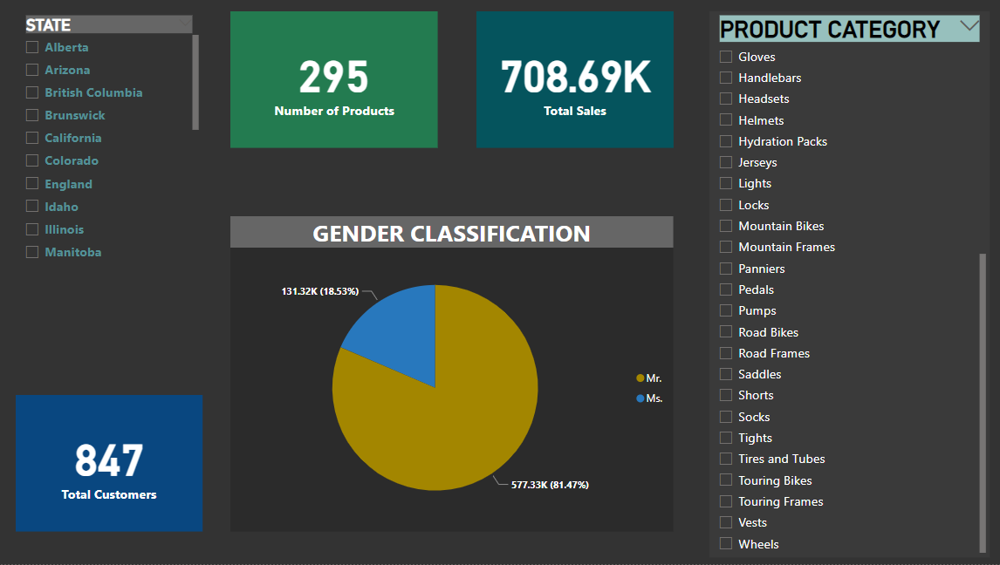

# Adventure Works Data Pipeline Project

## Project Overview

This project aims to build an automated data pipeline to ingest, transform, and store Adventure Works on-premises database data into Azure Data Lake Storage Gen2, with three **data layers: Bronze, Silver, and Gold**. The pipeline will then load the cleansed Gold data into Azure SQL Server using Azure Synapse Analytics. Finally, reports will be generated using Power BI.

## Project Workflow

1. **Data Ingestion**: Azure Data Factory (ADF) is used to ingest data from the on-premises Adventure Works database into Azure Data Lake Storage Gen2.

2. **Data Transformation**:
   - **Bronze Layer**: Raw data is stored in the Bronze layer.
   - **Silver Layer**: First-level transformations are applied to the data and stored in the Silver layer.
   - **Gold Layer**: Data is further cleansed and stored in the Gold layer.

3. **Data Loading**: Gold data is loaded into Azure SQL Server using Azure Synapse Analytics.

4. **Reporting**: Power BI is utilized to create reports for data analysis and visualization.

## Tools Used

1. Azure Data Factory
2. Azure Data Lake Storage Gen2
3. Azure Databricks
4. Azure Synapse Analytics
5. Azure Key Vault
6. Azure Active Directory (AAD)
7. Microsoft Power BI

## Automation

The data pipeline is scheduled to trigger automatically every day at 6 PM IST.

## [CICD Pipeline Doc](CICD_Pipeline.md)

## Report

## Reference

- [youtube video Mr. k Talks Tech](https://youtu.be/HCQWrbi6QfY)

- [Adventure-works-database](https://learn.microsoft.com/en-us/sql/samples/adventureworks-install-configure?view=sql-server-ver16&tabs=ssms)

- [Access Azure Data Lake Storage using Microsoft Entra ID (formerly Azure Active Directory) credential passthrough (legacy) - Azure Databricks | Microsoft Learn](https://learn.microsoft.com/en-us/azure/databricks/archive/credential-passthrough/adls-passthrough#--azure-data-lake-storage-gen2-1)
